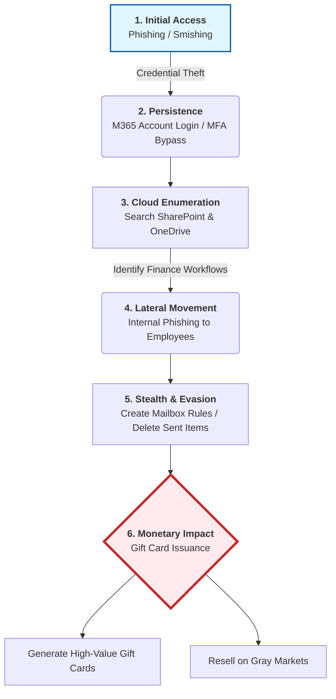

Lab 1 — CTI Report Mapping to MITRE ATT&CK
Group Members:
Daniel Shatzov
Ori Geva

Source CTI Report
[Jingle Thief: Inside a Cloud-Based Gift Card Fraud Campaign]
(http://unit42.paloaltonetworks.com/cloud-based-gift-card-fraud-campaign/)

Short Attack Summary
The report describes a cloud-based fraud campaign targeting organizations through Microsoft 365 accounts. 
The attackers used phishing or smishing to steal credentials and gain access to legitimate accounts. 
After gaining access, they searched internal resources such as SharePoint and OneDrive to understand the organization and find useful information. 
They then used compromised accounts to send internal phishing messages, making the attack more convincing. 
The attackers also created mailbox rules and deleted messages to hide their activity. 
The final goal was financial fraud, mainly gift card fraud.

Attack Diagram / Sequence

MITRE ATT&CK Mapping
| Tactic | Technique | Behavior from the Report | ATT&CK Link |
|---|---|---|---|
| Initial Access | Phishing / Spearphishing Link | The attackers used phishing or smishing to trick victims into entering Microsoft 365 credentials. | https://attack.mitre.org/techniques/T1566/002/ |
| Credential Access | Web Session Cookie / Credential Harvesting | The attackers obtained credentials and used them to access Microsoft 365 accounts. | https://attack.mitre.org/tactics/TA0006/ |
| Discovery | Cloud Service Dashboard / Cloud Service Discovery | The attackers searched SharePoint, OneDrive, Exchange, and Entra ID after gaining access. | https://attack.mitre.org/techniques/T1526/ |
| Lateral Movement | Internal Spearphishing | The attackers used compromised accounts to send phishing messages inside the organization. | https://attack.mitre.org/techniques/T1534/ |
| Collection | Email Collection / Data from Cloud Storage | The attackers accessed email and cloud files to collect useful information. | https://attack.mitre.org/techniques/T1114/ |
| Defense Evasion | Email Hiding Rules | The attackers created mailbox rules to hide or redirect suspicious emails. | https://attack.mitre.org/techniques/T1564/008/ |
| Defense Evasion | Indicator Removal | The attackers deleted emails to hide their activity. | https://attack.mitre.org/techniques/T1070/ |
| Impact | Financial Theft / Fraud | The attackers used the compromised accounts to perform gift card fraud. | https://attack.mitre.org/tactics/TA0040/ |

Insights / What We Learned:
This report shows that cloud account compromise can be as dangerous as malware-based attacks. 
Once attackers gain access to a legitimate Microsoft 365 account, they can use trusted services such as SharePoint, OneDrive, and Exchange to continue the attack. 
The case also demonstrates why phishing detection, mailbox rule monitoring, and identity-based alerts are important in modern cloud environments.
