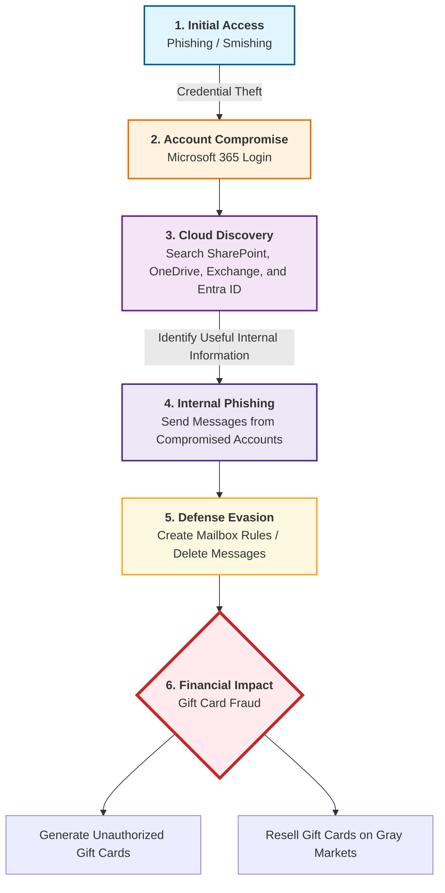

# Lab 1 — CTI Report Mapping to MITRE ATT&CK

## Group Members

- Daniel Shatzov
- Ori Geva

---

## Source CTI Report

**Report:** [Jingle Thief: Inside a Cloud-Based Gift Card Fraud Campaign](https://unit42.paloaltonetworks.com/cloud-based-gift-card-fraud-campaign/)  
**Source:** Palo Alto Networks — Unit 42

---

## Short Attack Summary

The report describes a cloud-based fraud campaign targeting organizations through compromised Microsoft 365 accounts.  
The attackers used phishing and smishing techniques to steal user credentials and gain access to legitimate cloud accounts.

After gaining access, the attackers explored internal Microsoft 365 services such as SharePoint, OneDrive, Exchange, and Entra ID.  
This allowed them to understand the victim organization, identify useful internal resources, and locate employees or workflows related to finance and gift card operations.

The attackers then used compromised accounts to send internal phishing messages, making the attack appear more trustworthy because the messages came from legitimate users inside the organization.  
To reduce detection, they created mailbox rules, redirected emails, and deleted messages related to their activity.

The final goal of the campaign was financial fraud, mainly through unauthorized gift card issuance and resale.  
This attack demonstrates how cloud account compromise can lead to significant business impact even without traditional malware.

---

## Attack Diagram / Sequence

---

## MITRE ATT&CK Mapping

| Tactic | Technique | Behavior from the Report | ATT&CK Link |
|---|---|---|---|
| Initial Access | Phishing / Spearphishing Link | The attackers used phishing or smishing messages to trick victims into entering their Microsoft 365 credentials. | [T1566.002 — Spearphishing Link](https://attack.mitre.org/techniques/T1566/002/) |
| Credential Access | Credential Harvesting | The attackers collected stolen credentials and used them to access legitimate Microsoft 365 accounts. | [TA0006 — Credential Access](https://attack.mitre.org/tactics/TA0006/) |
| Discovery | Cloud Service Discovery | After gaining access, the attackers searched Microsoft 365 services such as SharePoint, OneDrive, Exchange, and Entra ID. | [T1526 — Cloud Service Dashboard](https://attack.mitre.org/techniques/T1526/) |
| Lateral Movement | Internal Spearphishing | The attackers used compromised accounts to send phishing messages to other employees inside the organization. | [T1534 — Internal Spearphishing](https://attack.mitre.org/techniques/T1534/) |
| Collection | Email and Cloud Data Collection | The attackers accessed internal emails and cloud files to gather information that could support the fraud operation. | [T1114 — Email Collection](https://attack.mitre.org/techniques/T1114/) |
| Defense Evasion | Email Hiding Rules | The attackers created mailbox rules to hide, forward, or redirect emails related to their activity. | [T1564.008 — Email Hiding Rules](https://attack.mitre.org/techniques/T1564/008/) |
| Defense Evasion | Indicator Removal | The attackers deleted emails and other traces to reduce visibility and delay detection. | [T1070 — Indicator Removal](https://attack.mitre.org/techniques/T1070/) |
| Impact | Financial Theft / Fraud | The attackers used the compromised access to perform gift card fraud and generate financial profit. | [TA0040 — Impact](https://attack.mitre.org/tactics/TA0040/) |

---

## Insights / What We Learned

This report shows that cloud account compromise can be as dangerous as malware-based attacks.  
Once attackers gain access to a legitimate Microsoft 365 account, they can abuse trusted cloud services such as SharePoint, OneDrive, Exchange, and Entra ID to continue the attack.

The case also demonstrates the importance of monitoring identity activity, mailbox rules, suspicious login behavior, and internal phishing attempts.  
Modern cloud environments require strong phishing protection, multi-factor authentication monitoring, and detection mechanisms that focus not only on malware, but also on abnormal user and account behavior.
