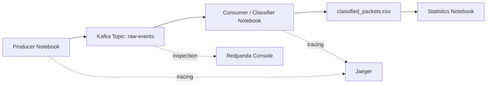
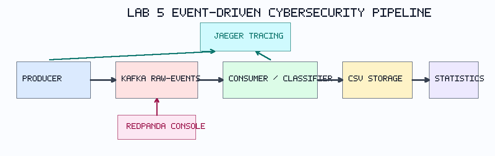
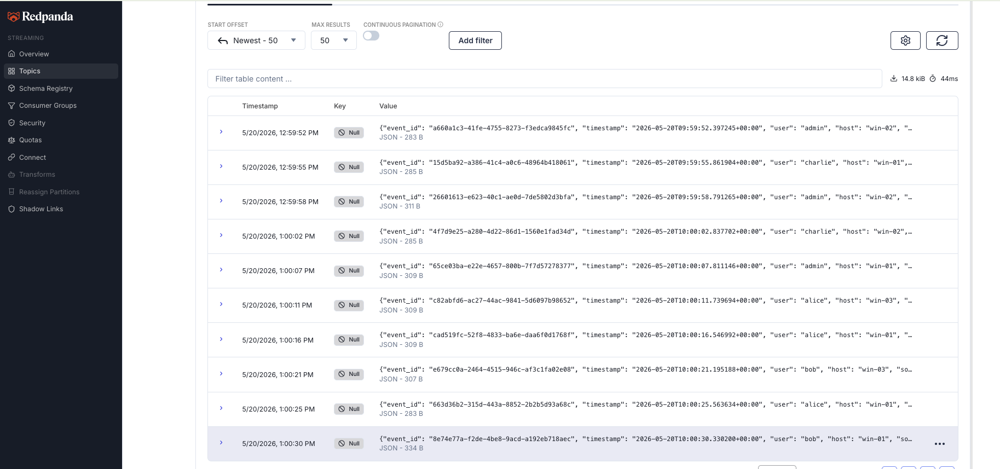
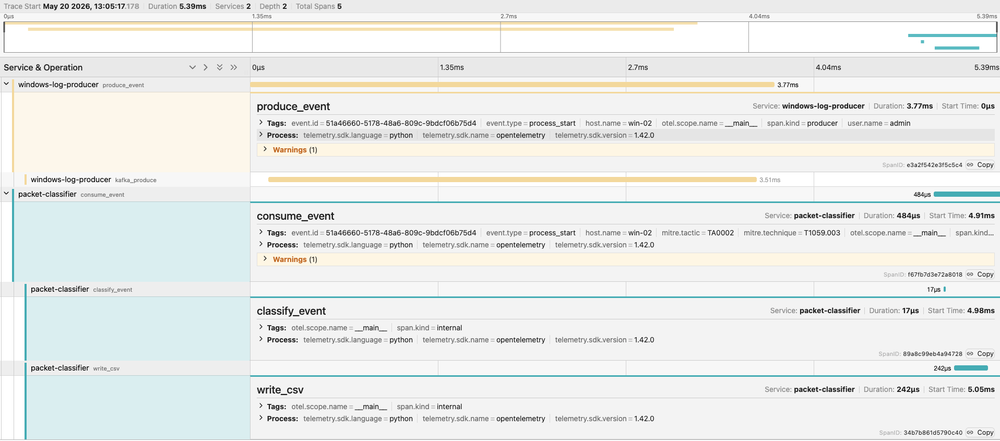
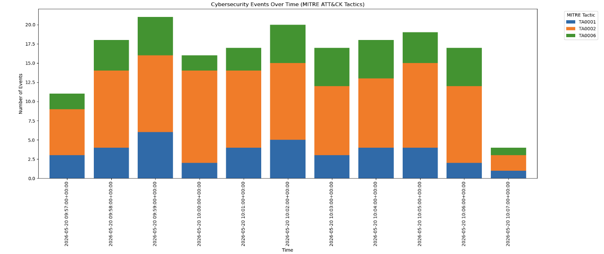

# Lab 5 — Event-Driven Cybersecurity Pipeline with Kafka and Tracing

## Group Members

- Daniel Shatzov
- Ori Geva

## Objective

The goal of this lab was to build and run a simple event-driven cybersecurity pipeline based on Kafka and distributed tracing. The focus of the assignment was not model training or performance optimization, but understanding how security events move through a decoupled pipeline and how tracing helps explain pipeline behavior.

In this lab, we worked with a small architecture that generates synthetic Windows-like security events, sends them to Kafka, classifies them with simple MITRE ATT&CK rules, stores the results locally in CSV format, and then visualizes the processed output.

## System Overview

The pipeline used in this lab follows this flow:

The producer notebook generates events and publishes them to the Kafka topic `raw-events`. The consumer notebook reads those events, classifies them, and writes the results to `classified_packets.csv`. The statistics notebook then loads the classified data and produces a basic visualization. At the same time, Jaeger receives tracing data so that the full event flow can be inspected, while Redpanda Console is used to inspect the Kafka topic itself.

The architecture diagram used in this submission is shown below:

## Implementation and Execution

The lab was executed in the following order:

1. Run `docker compose up` inside the Lab 5 environment.
2. Open JupyterLab, Redpanda Console, and Jaeger.
3. Run `1. Producer.ipynb` to begin generating synthetic events.
4. Verify that the `raw-events` topic appears in Redpanda Console and receives messages.
5. Run `2. Consumer_Classifier.ipynb` to consume and classify the events.
6. Verify that `classified_packets.csv` is created and updated locally.
7. Inspect Jaeger traces to confirm that the event flow is visible across stages.
8. Run `3. Statistics.ipynb` to visualize the processed results.

Each component in the pipeline had a separate role:

- The producer was responsible for generating synthetic Windows-like telemetry.
- Kafka was responsible for buffering and transporting events asynchronously.
- The consumer/classifier was responsible for reading events and mapping them to MITRE ATT&CK categories.
- CSV storage was used as a simple local persistence layer.
- The statistics notebook was responsible for basic post-processing and visualization.
- Jaeger was used to observe execution flow and timing.
- Redpanda Console was used to inspect Kafka topic contents.

## Results

The pipeline ran successfully from end to end.

### Kafka Topic Inspection

The screenshot below shows the `raw-events` topic in Redpanda Console with event messages present in the topic:

This confirms that the producer successfully generated and published events to Kafka.

### Jaeger Trace Inspection

The screenshot below shows Jaeger traces for the pipeline, including both `windows-log-producer` and `packet-classifier` spans:

This confirms that tracing was active across multiple pipeline stages and that a single event could be followed through the system.

### Statistics Visualization

The statistics notebook produced the following visualization:

This plot shows the distribution of processed events over time by MITRE tactic, which confirms that the classified CSV output was successfully generated and then used for analysis.

### Basic Statistics

The processed dataset from the current run contained 178 events in total.

Event type distribution:

- `process_start`: 99
- `user_login`: 79

MITRE tactic distribution:

- `TA0002`: 99
- `TA0006`: 41
- `TA0001`: 38

### Local Classification Output

A representative output sample is included here:

[classified_packets_sample.csv](results/classified_packets_sample.csv)

The sample includes the event ID, timestamp, user, host, source IP, event type, MITRE tactic, and MITRE technique. This confirms that classification results were stored locally as required by the assignment.

## MITRE ATT&CK Mapping

The classification logic in this lab was intentionally simple and rule-based. That matches the purpose of the assignment, which is to understand the pipeline architecture rather than build a strong ML classifier.

The main mappings used in the consumer notebook were:

- `T1059.001` — PowerShell
- `T1059.003` — Windows Command Shell
- `T1110` — Brute Force
- `T1078` — Valid Accounts

In practice, this means:

- PowerShell commands containing `EncodedCommand` were mapped to `TA0002 / T1059.001`.
- `cmd.exe` execution was mapped to `TA0002 / T1059.003`.
- Failed login events were mapped to `TA0006 / T1110`.
- Successful login events were mapped to `TA0001 / T1078`.

Even though the logic is simple, it is enough to demonstrate that the consumer receives security-relevant events, applies detection rules, and produces structured output.

## Discussion Questions

### Why is Kafka used instead of direct function calls?

Kafka is used because it separates the producer from the consumer. The producer does not need to know who will process the events or whether the consumer is currently busy. This makes the pipeline more flexible and more realistic for security systems that handle large volumes of incoming events.

### What happens if the consumer is slower than the producer?

If the consumer is slower, the messages stay in Kafka until they are processed. In other words, the queue absorbs the difference in speed. This is useful because the producer can continue working without waiting for the consumer, although a backlog or consumer lag may grow over time.

### How does tracing help debug pipeline behavior?

Tracing helps because it shows how one event moves through the pipeline step by step. Instead of only knowing that something failed, we can see which stage handled the event, how long each part took, and where delays or bottlenecks may have appeared.

### Which pipeline stages could be scaled independently?

The producer and consumer could be scaled independently because they are connected through Kafka rather than direct calls. In a larger system, the consumer/classifier stage would usually be the first candidate for scaling, since processing and classification are often heavier than event generation.

### How would this pipeline change in a real SOC system?

In a real SOC system, the data would come from actual telemetry sources such as endpoint agents, logs, or network sensors instead of synthetic events. The pipeline would probably include more topics, stronger schema validation, authentication, monitoring, alerting, and storage in a database or SIEM platform. The classification stage would also be more advanced and could include multiple consumers or more complex detection logic.

## Conclusion

This lab demonstrated how a simple cybersecurity pipeline can be built using asynchronous messaging, local storage, and distributed tracing. The main lesson was that the structure of the pipeline is just as important as the analysis itself. Kafka makes it possible to decouple event generation from event processing, and Jaeger makes it easier to understand what happens inside the system. Together, these tools provide a good introduction to the kind of event-driven architectures used in real security environments.
