# AI-Based Phishing Detection and Risk Assessment SOC Assistant

## Project Summary

This repository contains an AI in Cybersecurity final project: a local SOC assistant for suspicious email review. The system analyzes email subject/body text, runs a local machine learning phishing classifier, extracts phishing indicators such as URLs, IP addresses, urgent language, credential requests, attachment mentions, and suspicious keywords, maps supported evidence to MITRE ATT&CK, calculates a Low/Medium/High/Critical risk level, recommends analyst next steps, and writes safe audit logs without storing full email bodies. A Streamlit dashboard is included for the working demonstration.

The project runs locally and does not require external APIs, LLM APIs, or API keys.

## Course And Project Context

This is an integrated final project for the course **AI in Cybersecurity based on NVIDIA Morpheus**. It connects machine-learning-based phishing detection with CTI/SOC-style analysis so model output becomes explainable analyst context instead of only a label.

Course lab ideas reused in the project:

- **Lab1:** CTI reasoning and MITRE ATT&CK mapping.
- **Lab2:** dataset preparation, EDA, preprocessing, model training, evaluation metrics, and confusion matrix.
- **Lab3:** phishing indicators, risk scoring, JSON-style analysis output, and recommendations.
- **Lab4/Lab5:** SOC workflow, dashboard/prototype thinking, pipeline-style output, logging, and demo structure.

## Problem Statement

Security analysts receive suspicious emails that may contain phishing links, credential-harvesting language, spoofing hints, attachments, or financial lures. A lightweight assistant can help triage these messages by combining AI classification with deterministic security evidence, MITRE ATT&CK mapping, risk scoring, explanations, safe recommendations, and privacy-conscious audit logs.

## System Workflow

```text
Email input
-> preprocessing
-> phishing classifier
-> indicator extraction
-> MITRE ATT&CK mapping
-> risk scoring
-> explanation
-> recommendation
-> audit log
-> Streamlit dashboard
```



```mermaid
flowchart LR
    A[Email Input] --> B[Preprocessing]
    B --> C[Phishing Classifier]
    C --> D[Indicator Extraction]
    D --> E["MITRE ATT&CK Mapping"]
    E --> F[Risk Scoring]
    F --> G[Explanation]
    G --> H[Recommendations]
    H --> I[Safe Audit Log]
    I --> J[Streamlit Dashboard]
```

## Main Features

- Local TF-IDF plus Logistic Regression phishing classifier.
- Deterministic indicator extraction for URLs, domains, IP addresses, urgent language, credential requests, financial language, attachment mentions, shortened URL hints, spoofing hints, and suspicious keywords.
- Evidence-supported MITRE ATT&CK mapping for phishing links, attachments, user execution, and credential-access style behavior.
- Risk scoring module that combines model probability with indicator severity.
- Analyst-friendly explanation and recommendation modules.
- Safe CSV audit logging with SHA256 email hashes and metadata only.
- Streamlit dashboard for email input, sample loading, prediction, risk, indicators, MITRE mapping, recommendations, and audit preview.
- Pytest coverage for core modules and dashboard helpers.

## Repository Layout

```text
AI-CyberSecurity/
  Lab1/                     Course lab material used conceptually for CTI/MITRE ideas
  Lab2/                     Course lab material used for ML/EDA/preprocessing ideas
  Lab3/                     Course lab material used for indicators/risk/recommendations
  Lab4/                     Course lab material used for SOC workflow ideas
  Lab5/                     Course lab material used for demo/pipeline/logging ideas
  final_project/
    dashboard/app.py        Streamlit dashboard
    data/                   Raw/processed data folders and safe sample emails
    notebooks/              EDA notebook
    reports/                EDA summary and project form
    src/                    Reusable phishing SOC assistant modules
    tests/                  Pytest suite
    ARCHITECTURE.md         Architecture notes
    README.md               Short final-project run reference
    TESTING.md              Testing notes
    requirements.txt        Python dependencies
```

## Data

The project uses the **CEAS_08.csv** file from Kaggle's Phishing Email Dataset:

```text
https://www.kaggle.com/datasets/naserabdullahalam/phishing-email-dataset?resource=download&select=CEAS_08.csv
```

Expected local paths:

```text
final_project/data/raw/CEAS_08.csv
final_project/data/processed/ceas08_clean.csv
```

Important dataset facts:

- Raw dataset: 39,154 rows.
- Processed dataset: 39,085 rows.
- `label=1` means phishing/spam.
- `label=0` means benign/legitimate.
- The raw CEAS_08 `urls` column is binary and is converted to `has_url` during preprocessing.
- The processed CSV includes columns such as `text`, `label`, `has_url`, `subject`, `body`, and length features.

The raw and processed CSV files are intentionally ignored by Git because they are generated/local data artifacts. The processed dataset should be kept locally because it is required for model training and demos.

## Model And Evaluation

The baseline AI model is intentionally simple and explainable:

- `TfidfVectorizer`
- `LogisticRegression`
- stratified train/test split
- saved locally as `final_project/models/phishing_baseline.joblib`

Latest known baseline results:

| Metric | Value |
| --- | ---: |
| Accuracy | 0.9946 |
| Precision | 0.9968 |
| Recall | 0.9936 |
| F1-score | 0.9952 |

Confusion matrix:

```text
[[3439   14]
 [  28 4336]]
```

Interpretation:

- 3,439 benign emails were correctly classified as benign.
- 4,336 phishing emails were correctly classified as phishing.
- 14 benign emails were incorrectly flagged as phishing.
- 28 phishing emails were missed.

## MITRE ATT&CK Usage

The project maps evidence to MITRE ATT&CK only when supported by observed indicators. Example techniques include:

- `T1566` Phishing
- `T1566.001` Spearphishing Attachment
- `T1566.002` Spearphishing Link
- `T1204.001` User Execution: Malicious Link
- `T1204.002` User Execution: Malicious File
- `T1056.003` Input Capture: Web Portal Capture

The mapper is conservative. The dashboard displays only mappings returned by the backend pipeline.

## Quick Start

Run commands from the final project folder:

```bash
cd final_project
```

Create/activate your Python environment, then install dependencies:

```bash
python -m pip install -r requirements.txt
```

If the processed CSV is missing but the raw CSV exists, run preprocessing:

```bash
python -m src.preprocessing
```

Train or refresh the baseline model:

```bash
python -m src.train_baseline
```

Analyze one email from the command line:

```bash
python -m src.pipeline \
  --subject "Account verification required" \
  --text "Please verify your account at https://example.com"
```

Run the Streamlit dashboard:

```bash
streamlit run dashboard/app.py
```

Then open:

```text
http://localhost:8501
```

## Tests

Run the full test suite from `final_project/`:

```bash
python -m pytest tests -q
```

The tests cover:

- preprocessing
- data loading
- model prediction interface
- indicator extraction
- MITRE mapping
- risk scoring
- explanation and recommendations
- audit logging
- pipeline output
- dashboard helper behavior
- EDA report facts

## Dashboard Demo

The dashboard supports:

- subject input
- email body input
- 10 benign safe sample emails
- 10 phishing-style safe sample emails
- prediction label, phishing probability, and confidence
- risk score, risk level, and risk factors
- extracted indicators
- MITRE ATT&CK mapping table
- explanation
- recommendation bullets
- audit logging status
- safe audit log preview

Recommendations are advisory analyst actions only. The dashboard does not delete emails, block senders, reset credentials, or perform other destructive actions.

## Audit Logging And Privacy

Audit logs are written to:

```text
final_project/logs/audit_log.csv
```

The logger stores:

- timestamp
- SHA256 email hash
- text length
- prediction
- phishing probability
- confidence
- risk score
- risk level
- indicator summary
- MITRE technique IDs
- recommendation summary

The full email body is not stored in audit logs.

## Technologies

- Python
- pandas
- scikit-learn
- joblib
- pytest
- Streamlit
- Jupyter Notebook
- MITRE ATT&CK

## Safety And Scope

- No external APIs are required.
- No LLM API support is included.
- The system runs locally without API keys.
- Sample emails use fake/example-safe domains and do not include real credentials or real malicious infrastructure.
- The project does not perform automatic destructive actions.
- Audit logs are designed to avoid storing sensitive full email content.

## Limitations

This is a lightweight prototype, not a production SOC platform. The model was trained and evaluated on CEAS_08, so real organizational email traffic may behave differently. Deterministic indicator rules are explainable but can create false positives when benign messages contain words like password, account, invoice, or update. The dashboard analyzes manual input and safe samples; it is not integrated with a real mailbox, SIEM, SOAR platform, or NVIDIA Morpheus runtime pipeline.

## Related Documentation

- `final_project/README.md`: short run reference for the final project.
- `final_project/ARCHITECTURE.md`: architecture and workflow notes.
- `final_project/TESTING.md`: testing and verification notes.
- `final_project/reports/eda_summary.md`: EDA summary.
- `final_project/reports/project_form.md`: standard project form draft.
