```mermaid
flowchart LR
    A[Email Input] --> B[Preprocessing]
    B --> C[Phishing Classifier]
    C --> D[Indicator Extraction]
    D --> E["MITRE ATT&CK Mapping"]
    E --> F[Risk Scoring]
    F --> G[Explanation]
    G --> H[Recommendations]
    H --> I[Safe Audit Log]
    I --> J[Streamlit Dashboard]
```

# AI-CyberSecurity Course Repository

## Project Overview

This repository contains coursework and the final project for **AI in Cybersecurity based on NVIDIA Morpheus**. The final project is an integrated cybersecurity AI prototype named **AI-Based Phishing Detection and Risk Assessment SOC Assistant**.

The system analyzes suspicious emails, uses a local phishing classifier, extracts cybersecurity indicators, maps evidence to MITRE ATT&CK, calculates a risk level, recommends analyst actions, and writes privacy-conscious audit logs. It also includes a Streamlit dashboard for a working local demonstration.

The project runs locally without external APIs, LLM APIs, or API keys. Full email bodies are not stored in audit logs.

## Course Context

The final project connects machine learning with CTI and SOC-style analysis. It reuses ideas from the course labs:

| Course area | How it is reflected in the final project |
| --- | --- |
| Lab1 | CTI reasoning and MITRE ATT&CK mapping |
| Lab2 | Dataset preparation, EDA, preprocessing, model training, evaluation, and confusion matrix |
| Lab3 | Indicators, risk scoring, JSON-style output, and recommendations |
| Lab4/Lab5 | SOC workflow, dashboard prototype, pipeline thinking, logging, and demo structure |

## High-Level Workflow

```text
Email input
-> preprocessing
-> phishing classifier
-> indicator extraction
-> MITRE ATT&CK mapping
-> risk scoring
-> explanation
-> recommendation
-> audit log
-> Streamlit dashboard
```



## Repository Layout

```text
AI-CyberSecurity/
  Lab1/                 Course lab material for CTI concepts
  Lab2/                 Course lab material for ML, EDA, and preprocessing
  Lab3/                 Course lab material for indicators, risk, and recommendations
  Lab4/                 Course lab material for SOC workflow concepts
  Lab5/                 Course lab material for pipeline and demo concepts
  final_project/        Main phishing SOC assistant implementation
```

## Final Project Entry Point

Use the detailed final project guide here:

```text
final_project/README.md
```

That README explains:

- project goal and problem statement
- dataset source and preprocessing
- model training and evaluation results
- end-to-end pipeline usage
- Streamlit dashboard usage
- audit logging safety
- testing commands
- limitations and Morpheus/course connection

## Safety Notes

- No external API or API key is required.
- No LLM API support is included.
- The system does not automatically delete emails, block senders, or reset credentials.
- Demo samples use fake/example-safe data.
- Audit logs store metadata and SHA256 email hashes, not full email bodies.

## Submission Status

The implementation prototype is complete. Remaining course submission items, if not already finished, are the final written report, poster, and 5-7 minute demo recording.
