# AI-Based Phishing Detection and Risk Assessment SOC Assistant

## Project Goal

Build a lightweight local SOC assistant that reviews suspicious emails, detects phishing risk, extracts phishing indicators, maps evidence to MITRE ATT&CK, explains why an email is risky, recommends safe analyst actions, and writes audit logs without storing full sensitive email bodies.

The project is designed as an AI in Cybersecurity final project. It combines a simple explainable machine learning baseline with deterministic CTI/SOC-style evidence processing.

## Problem Statement

Security analysts often need to triage suspicious emails quickly. A single phishing prediction is useful, but it is not enough for analyst work. Analysts also need to understand what evidence was found, how that evidence maps to known adversary behavior, what the risk level is, and what actions should be reviewed next.

This project addresses that need by combining:

- local phishing classification
- rule-based indicator extraction
- MITRE ATT&CK mapping
- risk scoring
- analyst-friendly explanations
- safe recommendations
- privacy-conscious audit logging
- a Streamlit dashboard for demonstration

The system runs locally without external APIs, LLM APIs, or API keys.

## End-To-End Workflow

```text
Email input
-> preprocessing
-> phishing classifier
-> indicator extraction
-> MITRE ATT&CK mapping
-> risk scoring
-> explanation
-> recommendation
-> audit log
-> Streamlit dashboard
```



```mermaid
flowchart LR
    A[Email Input] --> B[Preprocessing]
    B --> C[Phishing Classifier]
    C --> D[Indicator Extraction]
    D --> E["MITRE ATT&CK Mapping"]
    E --> F[Risk Scoring]
    F --> G[Explanation]
    G --> H[Recommendations]
    H --> I[Safe Audit Log]
    I --> J[Streamlit Dashboard]
```

## Module Responsibilities

| Module | Purpose |
| --- | --- |
| `src/data_loader.py` | Loads CSV datasets, validates required columns, and reports dataset summaries |
| `src/preprocessing.py` | Prepares raw CEAS_08 data and normalizes email text for inference |
| `src/train_baseline.py` | Trains and evaluates the TF-IDF plus Logistic Regression baseline model |
| `src/model.py` | Loads the saved model and returns prediction, phishing probability, and confidence |
| `src/indicator_extractor.py` | Extracts URLs, domains, IP addresses, suspicious language, credential requests, attachments, and related signals |
| `src/mitre_mapper.py` | Maps supported evidence to MITRE ATT&CK techniques |
| `src/risk_scoring.py` | Combines model probability and indicator severity into a 0-100 risk score |
| `src/explainer.py` | Generates analyst-friendly explanation text |
| `src/recommendations.py` | Generates safe analyst-review recommendations |
| `src/audit_logger.py` | Writes safe audit metadata without full email bodies |
| `src/pipeline.py` | Orchestrates the full analysis workflow |
| `dashboard/app.py` | Provides the Streamlit SOC assistant dashboard |

## Dataset

The project uses `CEAS_08.csv` from Kaggle's Phishing Email Dataset:

```text
https://www.kaggle.com/datasets/naserabdullahalam/phishing-email-dataset?resource=download&select=CEAS_08.csv
```

Expected local paths:

```text
data/raw/CEAS_08.csv
data/processed/ceas08_clean.csv
```

Dataset facts:

| Item | Value |
| --- | --- |
| Raw dataset rows | 39,154 |
| Raw dataset columns | `sender`, `receiver`, `date`, `subject`, `body`, `label`, `urls` |
| Processed dataset rows | 39,085 |
| Processed dataset columns | `sender`, `subject`, `body`, `label`, `has_url`, `text`, `text_length`, `subject_length`, `body_length` |
| Positive label | `label=1` means phishing/spam |
| Negative label | `label=0` means benign/legitimate |
| URL feature | Raw `urls` is binary and is converted to `has_url` |

The raw and processed CSV files are intentionally ignored by Git because they are local data artifacts. Keep the processed CSV locally because it is required to train the model.

## Preprocessing

Preprocessing uses the raw CEAS_08 file and generates the cleaned processed dataset.

Run from `final_project/` only if the processed CSV is missing or preprocessing logic changed:

```bash
python -m src.preprocessing
```

What preprocessing does:

- validates required raw columns
- normalizes labels to `0` and `1`
- removes rows with missing or blank subjects
- converts raw binary `urls` to `has_url`
- combines subject and body into `text`
- adds text length features
- removes duplicate combined text rows
- removes extreme text rows above 50,000 characters

Do not manually edit the raw CSV.

## Baseline Model

The AI model is intentionally simple, local, and explainable:

| Component | Choice |
| --- | --- |
| Text representation | TF-IDF |
| Classifier | Logistic Regression |
| Split | Stratified train/test split |
| Saved artifact | `models/phishing_baseline.joblib` |
| Label mapping | `1 = phishing/spam`, `0 = benign/legitimate` |

Train or refresh the model from `final_project/`:

```bash
python -m src.train_baseline
```

If using the included virtual environment:

```bash
.venv/bin/python -m src.train_baseline
```

The training command prints:

- accuracy
- precision
- recall
- F1-score
- confusion matrix
- classification report

## Main Model Results

Latest known baseline results:

| Metric | Value |
| --- | ---: |
| Accuracy | 0.9946 |
| Precision | 0.9968 |
| Recall | 0.9936 |
| F1-score | 0.9952 |

Confusion matrix:

```text
[[3439   14]
 [  28 4336]]
```

Interpretation:

| Cell | Meaning | Count |
| --- | --- | ---: |
| TN | Benign emails correctly classified as benign | 3,439 |
| FP | Benign emails incorrectly flagged as phishing | 14 |
| FN | Phishing emails missed by the model | 28 |
| TP | Phishing emails correctly classified as phishing | 4,336 |

Even with strong baseline results, false negatives matter because missed phishing can create security risk. This is one reason the project combines the model with indicators, MITRE mapping, and risk scoring.

## Indicator Extraction

The indicator extractor is deterministic and rule-based. It does not call external services.

It extracts:

- URLs
- domains
- IP addresses
- urgent language
- credential request language
- financial/payment language
- attachment mentions
- suspicious sender hints
- shortened URL hints
- suspicious keywords

These indicators are used for explanation, MITRE mapping, and risk scoring. They are evidence signals, not proof by themselves.

## MITRE ATT&CK Mapping

The MITRE mapper only returns mappings supported by observed evidence.

Example mappings:

| Technique ID | Technique name | Typical evidence |
| --- | --- | --- |
| `T1566` | Phishing | Phishing-style message evidence |
| `T1566.001` | Spearphishing Attachment | Attachment lure or file mention |
| `T1566.002` | Spearphishing Link | URL/link evidence |
| `T1204.001` | User Execution: Malicious Link | Email asks user to interact with a link |
| `T1204.002` | User Execution: Malicious File | Email asks user to open a file |
| `T1056.003` | Input Capture: Web Portal Capture | Credential request language with URL evidence |

The dashboard displays only mappings returned by the pipeline.

## Risk Scoring

Risk scoring combines:

- model phishing probability
- URLs
- shortened URL hints
- IP addresses
- urgent language
- credential request language
- attachment mentions
- financial language
- MITRE mapping count

Risk levels:

| Score range | Level |
| --- | --- |
| 0-24 | Low |
| 25-49 | Medium |
| 50-74 | High |
| 75-100 | Critical |

The output includes human-readable risk factors so an analyst can see why points were added.

## Pipeline CLI

The main pipeline function is:

```python
from src.pipeline import analyze_email

result = analyze_email(email_text="...", subject="...", log=True)
```

The CLI can be run from `final_project/`:

```bash
python -m src.pipeline \
  --subject "Account verification required" \
  --text "Please verify your account at https://example.com"
```

Use the safe phishing sample:

```bash
python -m src.pipeline \
  --subject "Action required" \
  --text "$(cat data/samples/phishing_email.txt)"
```

Use the safe benign sample:

```bash
python -m src.pipeline \
  --subject "Team lunch update" \
  --text "$(cat data/samples/benign_email.txt)"
```

Run without writing an audit log:

```bash
python -m src.pipeline \
  --subject "Account verification required" \
  --text "Please verify your account at https://example.com" \
  --no-log
```

Expected JSON output categories:

| Key | Meaning |
| --- | --- |
| `prediction` | model label, phishing probability, and confidence |
| `indicators` | extracted URLs, domains, IPs, suspicious language, and related evidence |
| `mitre_mappings` | supported MITRE ATT&CK techniques |
| `risk` | risk score, risk level, and risk factors |
| `explanation` | analyst-friendly explanation |
| `recommendations` | safe analyst actions |
| `audit_logged` | whether an audit row was written |
| `input_metadata` | email hash, text length, and source |

## Streamlit Dashboard

Run from `final_project/`:

```bash
streamlit run dashboard/app.py
```

If using the included virtual environment:

```bash
.venv/bin/streamlit run dashboard/app.py
```

Open:

```text
http://localhost:8501
```

Dashboard usage:

1. Use the **Benign sample** dropdown to choose one of 10 safe benign examples, then select **Load selected benign sample**.
2. Use the **Phishing sample** dropdown to choose one of 10 safe phishing-style examples, then select **Load selected phishing sample**.
3. Or type a custom subject and email body.
4. Select **Analyze**.
5. Review the analysis panels.

Dashboard panels:

| Panel | What it shows |
| --- | --- |
| Analysis Summary | prediction, phishing probability, confidence, and risk level |
| Risk factors | human-readable reasons that contributed to the risk score |
| Extracted Indicators | URLs, domains, IPs, urgent language, credential requests, attachments, suspicious keywords, and shortened URL hints |
| MITRE ATT&CK Mapping | technique ID, technique name, tactic, and evidence |
| Explanation | analyst-friendly reasoning from the pipeline |
| Recommendations | safe next steps for analyst review |
| Audit Log Preview | recent safe metadata rows only |

Missing model troubleshooting:

If the dashboard shows a missing model error, train the model first:

```bash
python -m src.train_baseline
```

or:

```bash
.venv/bin/python -m src.train_baseline
```

Then rerun:

```bash
streamlit run dashboard/app.py
```

## Safe Demo Samples

Safe sample emails live in:

```text
data/samples/
```

The dashboard includes:

- 10 benign examples
- 10 phishing-style examples

The samples use fake/example-safe wording and domains. They do not contain real credentials, real malicious infrastructure, or private data.

Some phishing-style samples may be model-classified as benign but still receive High or Critical risk because the rule-based evidence is strong. This is expected and shows why the system combines model output with indicators and risk scoring.

## Audit Logging Safety

Audit rows are appended to:

```text
logs/audit_log.csv
```

Stored fields:

| Field | Purpose |
| --- | --- |
| `timestamp_utc` | analysis time |
| `email_hash` | SHA256 hash of the analyzed email input |
| `text_length` | analyzed text length |
| `prediction` | model prediction |
| `phishing_probability` | model phishing probability |
| `confidence` | model confidence |
| `risk_score` | numeric risk score |
| `risk_level` | Low, Medium, High, or Critical |
| `indicator_summary` | indicator counts and boolean flags |
| `mitre_technique_ids` | mapped MITRE technique IDs |
| `recommendation_summary` | analyst recommendation summary |

The full email body is not stored. The dashboard audit preview displays only safe metadata columns.

## Testing

Run all tests from `final_project/`:

```bash
python -m pytest tests -q
```

No-cache validation command:

```bash
PYTHONDONTWRITEBYTECODE=1 .venv/bin/python -m pytest tests -q -p no:cacheprovider
```

Test coverage includes:

- data loading
- preprocessing
- model prediction interface
- indicator extraction
- MITRE mapping
- risk scoring
- explanation and recommendations
- audit logging safety
- full pipeline output
- dashboard helper behavior
- EDA report facts

## Requirements

Install dependencies from `final_project/`:

```bash
python -m pip install -r requirements.txt
```

Main packages:

- pandas
- numpy
- scikit-learn
- joblib
- matplotlib
- streamlit
- pytest
- python-dotenv

## Course And Morpheus Connection

This project follows the pipeline-based cybersecurity AI idea introduced in the NVIDIA Morpheus course. Morpheus is designed for security pipelines that ingest data, preprocess it, run machine learning inference, enrich results with security context, and produce SOC-ready output.

This prototype does not directly deploy the NVIDIA Morpheus runtime. Instead, it applies the same architecture at a lightweight local scale. A suspicious email is treated as a security event. The system preprocesses the email text, applies model inference, extracts indicators, maps evidence to MITRE ATT&CK, calculates risk, explains the result, recommends analyst actions, and logs the event safely.

Lab connections:

| Lab | Project connection |
| --- | --- |
| Lab1 | CTI-style interpretation and MITRE ATT&CK mapping |
| Lab2 | dataset preparation, EDA, preprocessing, training, evaluation |
| Lab3 | indicators, risk scoring, JSON-style output, recommendations |
| Lab4/Lab5 | SOC workflow, dashboard/demo structure, pipeline-style outputs, logging |

## Safety And Scope

- The system runs locally.
- No external API or API key is required.
- No LLM API support is included.
- The dashboard does not delete emails, block senders, reset credentials, or perform destructive actions.
- Recommendations are analyst-review actions only.
- Audit logs store hashes and metadata, not full email bodies.

## Limitations

This is a lightweight prototype, not a production SOC platform. The model was trained and evaluated on CEAS_08, so performance on real organizational email traffic may differ.

The rule-based indicators and risk scoring make the system explainable, but they can create false positives when benign messages contain words such as password, account, invoice, or update.

The dashboard analyzes manual input and safe demo samples. It is not integrated with a real mailbox, SIEM, SOAR platform, or NVIDIA Morpheus streaming deployment.
